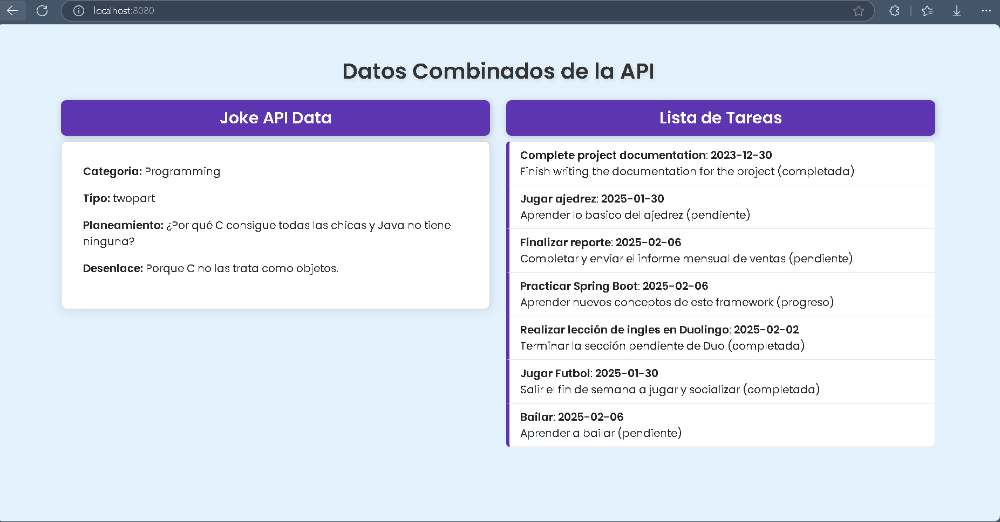
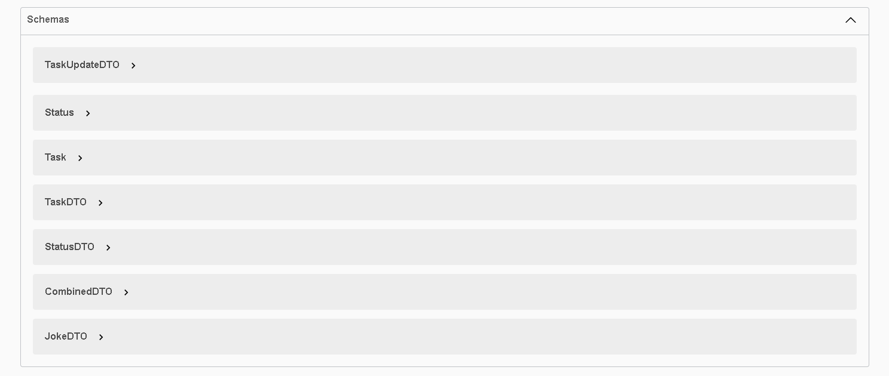

# API REST de Gestión de Tareas

Este es mi primer proyecto de una API REST para la gestión de tareas. La API proporciona endpoints que permiten manejar datos tanto con DTOs como sin ellos.

Actualmente, la API está en desarrollo, pero ya soporta operaciones CRUD básicas. Además, integra datos de una API externa (JokeAPI), lo que me permite practicar el consumo y combinación de datos provenientes de diferentes fuentes.

## Tecnologías Utilizadas
- Java
- Spring Boot
- Spring Data JPA
- MYSQL 

## Pasos previos para el funcionamiento correcto
Los siguientes estados se proporcionan de manera predeterminada: Pendiente, En proceso y Terminada.
Al crear una tarea, se deberá utilizar uno de estos estados predefinidos.

Si es necesario, también se puede crear un estado personalizado a través del siguiente endpoint:

📌 Endpoint: POST /api/statusDTO
 
 Ejemplo del JSON para realizar la petición:

{ "statusName":"prueba" }

### Endpoints Para mas claridad se recomienda usar Swagger accediendo a la ruta /api-docs

**POST /api/tasksDTO** - Crear una nueva tarea utilizando DTO

Ejemplo de cuerpo de la solicitud (JSON):

{
  "title": "Mi tarea",
  "description": "Descripción de la tarea",
  "dueDate": "2024-12-31",
  "statusName": "pendiente"
}

**POST /api/tasks** - Crear una nueva tarea

Ejemplo de cuerpo de la solicitud (JSON):

{
    "title": "Complete project documentation",
    "description": "Finish writing the documentation for the project",
    "dueDate": "2023-12-31",
    "status": {
        "id": 1
    }
}
### **GET /api/tasksDTO** - Obtener todas las tareas usando el DTO, excluyendo el campo `id` de las tareas.

Este endpoint devuelve una lista de todas las tareas almacenadas, pero con los datos enviados a través del **DTO (Data Transfer Object)**,
donde el campo `id` de las tareas está restringido para no ser expuesto en la respuesta.

#### Respuesta Exitosa (200 OK)

- **Cuerpo de la respuesta:**

  
   {
    "title": "Mi tarea",
    "description": "Descripción de la tarea",
    "dueDate": "2024-12-31",
    "statusName": "pendiente"
   }

## Prueba de conectividad y respuesta de la API

## Documentación de Swagger en /api-docs

