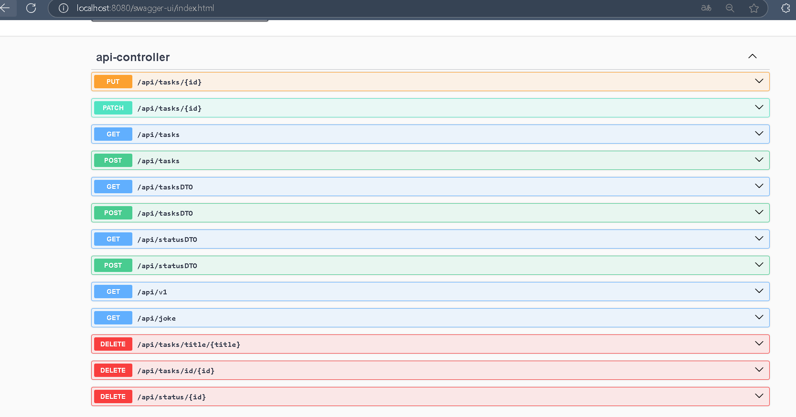

# API REST de Gestión de Tareas

Este es mi primer proyecto de una API REST que permite gestionar tareas. La API incluye endpoints que manejan datos tanto con como sin el uso de DTOs. 
Aún está en desarrollo, pero actualmente puedes realizar operaciones CRUD básicas.

## Tecnologías Utilizadas
- Java
- Spring Boot
- Spring Data JPA
- MYSQL 

## Pasos previos para el funcionamiento correcto
Antes de crear una tarea, se recomienda hacer una petición POST al siguiente endpoint para registrar previamente los estados (status) y asegurarse de que estén disponibles:

📌 Endpoint:
**POST /api/statusDTO** 

Registrar los estados antes de crear una tarea garantizará que se pueda asignar correctamente un estado a cada una, a continuacion ejemplo del JSON para realizar la petición:

{
  "statusName":"prueba"
}

### Endpoints Para mas claridad se recomienda usar Swagger accediendo a la ruta /api-docs

**POST /api/tasksDTO** - Crear una nueva tarea utilizando DTO

Ejemplo de cuerpo de la solicitud (JSON):

{
  "title": "Mi tarea",
  "description": "Descripción de la tarea",
  "dueDate": "2024-12-31",
  "statusName": "pendiente"
}

**POST /api/tasks** - Crear una nueva tarea

Ejemplo de cuerpo de la solicitud (JSON):

{
    "title": "Complete project documentation",
    "description": "Finish writing the documentation for the project",
    "dueDate": "2023-12-31",
    "status": {
        "id": 1
    }
}
### **GET /api/tasksDTO** - Obtener todas las tareas usando el DTO, excluyendo el campo `id` de las tareas.

Este endpoint devuelve una lista de todas las tareas almacenadas, pero con los datos enviados a través del **DTO (Data Transfer Object)**,
donde el campo `id` de las tareas está restringido para no ser expuesto en la respuesta.

#### Respuesta Exitosa (200 OK)

- **Cuerpo de la respuesta:**

  
   {
    "title": "Mi tarea",
    "description": "Descripción de la tarea",
    "dueDate": "2024-12-31",
    "statusName": "pendiente"
   }

## Index básico para corroborar el correcto funcionamiento de los datos

## Docmunetacion de Swagger en /api-docs

